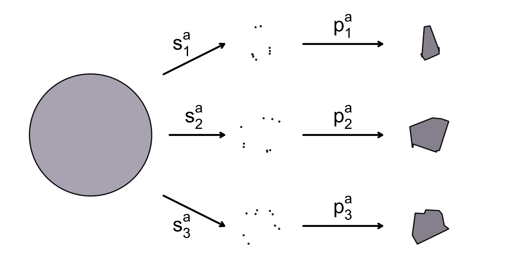
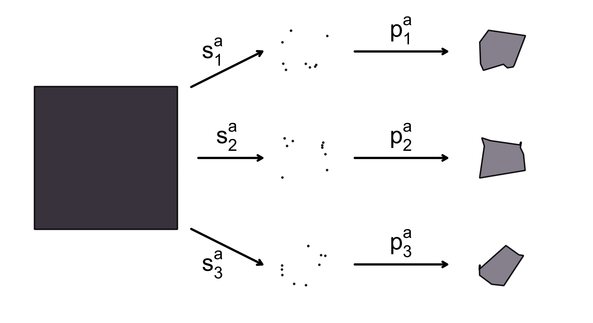

# discrimability
Greg Kiar  
January 13, 2017  

# Discriminability in a Nutshell

We are going to generate data from two classes (circles and squares), and demonstrate the
strength of discriminability through evaluating different sampling or processing strategies.
We construct our two class distributions, sample points from them, reconstruct the object,
compute the discriminability of the processing. Discriminability is: computing distance between
all pairs of objects, rank the distances, compute the histogram of same-class ranks, and compute
the mean rank of the distribution.

Before getting started, we will define a few helpful functions and variables which will streamline
this process.

## Setup

### Package Imports


```r
library(abind)
library(rmarkdown)
library(knitr)
library(RColorBrewer)
library(gplots)
sapply(X=dir('../../Code/FlashRupdated/functions/', full.names = TRUE), FUN = source, verbose=FALSE)
graphics.off()
set.seed(123456789)
```


### Variables

```r
lweight <- 4
len <- 500
nsamples <- 20
nsims <- 3
noise1 <- 0.2
tsize <- 4
nsize <- 3
darkcol <- '#28282e'
lightcol <- '#98929e'
```

### Distribution functions

```r
circle <- function(){
  theta <- seq(from = 0, to = 2*pi - pi/len, by = 2*pi/len)
  x <- cos(theta)
  y <- sin(theta)
  circ <- list(x, y)
}

square <- function(){
  range <- seq(from = -1, to = 1, by = 2/(len/4))
  static <- rep(1, each = len/4)
  x <- c(range, static, -range, -static) 
  y <- c(static, -range, -static, range)
  sqr <- list(x, y)
}
```

### Plotting functions

```r
plotshape <- function(xs, ys, typ){
  size <- lweight
  if (typ == 'p'){
    size <- size/3
  }
  plot(xs, ys, type=typ, axes=FALSE, xlab='', ylab='', pch=20, asp=1, lwd=size, col=darkcol)
  if (typ == 'l'){
    polygon(x=xs, y=ys, col=lightcol)
  }
}

plotheatmap <- function(data, title=""){
  cols <- colorRampPalette(c("green", "yellow", "red"))(n = 299)
  cols <- c('gray43', cols)
  heatmap.2(data, cellnote=round(data,1), Colv=NA, Rowv=NA, trace="none",
            density.info="none", notecol="black", col=cols, notecex=nsize,
            labRow="", labCol="", key=FALSE, lwid=c(.5,6), lhei=c(.5,6),
            margins=c(4.5,4.5), dendrogram="none")
  par(xpd=NA)
  text(x=0.48, y=1.05, title, cex=nsize)
}

plothistogram <- function(data, title=""){
  layout(1)
  h <- hist(data, breaks=seq(0, 1, l=20), plot=FALSE)
  hist(data, prob=TRUE, col="grey", breaks=seq(0, 1, l=20), ylab="",
       xlab="", main="", xlim=c(0, 1), axes=FALSE)
  d1 <- density(data, bw=0.05, from=0, to=1)
  print(d1)
  lines(d1, col="blue", lwd=lweight)
  lines(density(data, bw=0.1, from=0, to=1), lty="dotted", col="darkgreen", lwd=lweight)

  mx <- max(h$count)
  text(x=0.5, y=mx+4, title, cex=nsize)
  text(x=0, y=-mx/15, "0", cex=nsize-1)
  text(x=1, y=-mx/15, "1", cex=nsize-1)
  text(x=0.5, y=-mx/10, "Rank", cex=tsize-1)

  mnr <- mean(data)
  lines(c(mnr, mnr), c(0, mx+1), col="red", lwd=lweight)
  text(x=mnr, mx+1.5, paste("MNR:", as.character(round(mnr, 2))), cex=nsize-1)
}
```

### Sampling functions

```r
sample2 <- function(data, n){
  pts <- floor(runif(n, min=1, max=len))
  xs <- data[[1]]
  x <- xs[pts] + noise1*runif(n, min=-1, max=1)
  x <- c(x, x[1])
  ys <- data[[2]]
  y <- ys[pts] + noise1*runif(n, min=-1, max=1)
  y <- c(y, y[1])
  samp <- list(x, y)
}

sample1 <- function(data, n){
  pts <- sort(floor(runif(n, min=1, max=len)))
  xs <- data[[1]]
  x <- xs[pts] + noise1*runif(n, min=-1, max=1)
  x <- c(x, x[1])
  ys <- data[[2]]
  y <- ys[pts] + noise1*runif(n, min=-1, max=1)
  y <- c(y, y[1])
  samp <- list(x, y)
}
```

### Utility functions

```r
distances <- function(data, title=""){
  diff <- matrix(data=NA, nrow=2*nsims, ncol=2*nsims)
  for (i in 1:(2*nsims)){
    for (j in 1:(2*nsims)){
      diff[i,j] <- norm(data[,,i] - data[,,j], '2')
    }
  }
  plotheatmap(diff, title=title)
  return(diff)
}

simulate_shape <- function(fn){
  layout(matrix(c(1,2,3, 1,4,5, 1,6,7), 3, 3, byrow = TRUE))
  par(xpd=NA)
  shape <- fn()
  plotshape(shape[[1]], shape[[2]], 'l')
  
  arrows(x0=1.2, x1=2.2, y0=1, y1=1.5, length=0.1, lwd = lweight)
  arrows(x0=1.3, x1=2.2, y0=0, y1=0, length=0.1, lwd = lweight)
  arrows(x0=1.2, x1=2.2, y0=-1, y1=-1.5, length=0.1, lwd = lweight)
  text(x=1.5, y=1.5, expression('s'[1]^'a'), cex=tsize)
  text(x=1.7, y=0.3, expression('s'[2]^'a'), cex=tsize)
  text(x=1.5, y=-1.5, expression('s'[3]^'a'), cex=tsize)

  arrows(x0=3.5, x1=4.8, y0=1.5, y1=1.5, length=0.1, lwd=lweight)
  arrows(x0=3.5, x1=4.8, y0=0, y1=0, length=0.1, lwd=lweight)
  arrows(x0=3.5, x1=4.8, y0=-1.5, y1=-1.5, length=0.1, lwd=lweight)

  text(x=4.15, y=1.8, bquote(p[.(1)]^'a'), cex=tsize)
  text(x=4.15, y=0.3, bquote(p[.(2)]^'a'), cex=tsize)
  text(x=4.15, y=-1.2, bquote(p[.(3)]^'a'), cex=tsize)
  
  label <- c()
  data <- array(data=NA, c(2, nsamples, nsims))
  dim(data)
  for (i in 1:nsims){
    samp <- sample1(shape, nsamples)
    if (i <= 3){
      plotshape(samp[[1]], samp[[2]], 'p')
      plotshape(samp[[1]], samp[[2]], 'l')
    }
    data[1, ,i] <- samp[[1]][1:nsamples]
    data[2, ,i] <- samp[[2]][1:nsamples]
    label <- c(label, as.character(substitute(fn)))
  }
  values <- list(label, data)
}
```

## Sampling shapes

We will start by sampling data from the circle distribution and reconstructing the shapes
from each set of samples.


```r
vals <- simulate_shape(circle)
```

<figure><figcaption></figcaption></figure>

```r
labels <- vals[[1]]
data <- vals[[2]]
```

The same process is then repeated for the square distribution.

```r
vals <- simulate_shape(square)
```

<figure><figcaption></figcaption></figure>

```r
labels <- c(labels, vals[[1]])
data <- abind(data, vals[[2]])
```

## Compute distances
Now we have a data matrix which contains `x` and `y` sampled values, and a list of labels
for each sample identifying whether it belongs to the "circle" or "square" distribution.
We can then compute the distance between observations in each class.

```r
print(labels)
```

```
# [1] "circle" "circle" "circle" "square" "square" "square"
```

```r
print(dim(data))
```

```
# [1]  2 20  6
```

```r
diff <- distances(data, title="Distance (Method A)")
```

<figure><figcaption></figcaption></figure>

## Rank distances
Next, we can rank this matrix to observe the distances between objects in- and across-
class, and compute the rank distribution function (rdf) of our processed data.

```r
rankmatrix <- apply(diff, 1, rank, ties.method="average") - 1
plotheatmap(rankmatrix, "Rank Distance (Method A)")
```

<figure><figcaption></figcaption></figure>

```r
ranks <- rdf(diff, labels)
plothistogram(ranks, "Rank Distribution Function")
```

<figure><figcaption></figcaption></figure>

```
# 
# Call:
# 	density.default(x = data, bw = 0.05, from = 0, to = 1)
# 
# Data: data (12 obs.);	Bandwidth 'bw' = 0.05
# 
#        x              y           
#  Min.   :0.00   Min.   :0.000000  
#  1st Qu.:0.25   1st Qu.:0.000000  
#  Median :0.50   Median :0.000000  
#  Mean   :0.50   Mean   :0.507304  
#  3rd Qu.:0.75   3rd Qu.:0.000031  
#  Max.   :1.00   Max.   :7.978846
```

```r
# X <- data.frame(x=ranks)
# library(ggplot2)
# g <- ggplot(data = X, aes(x = x))
# g + geom_histogram(aes(y = ..density..), bins = 50, alpha = 0.25) + geom_density(alpha = 0.25) + scale_x_continuous(limits= c(0, 1))
```

